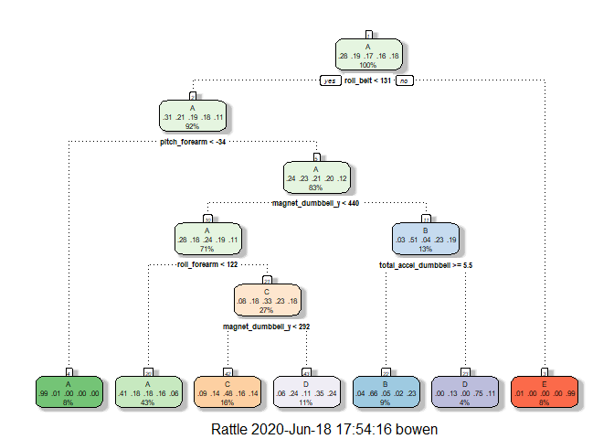
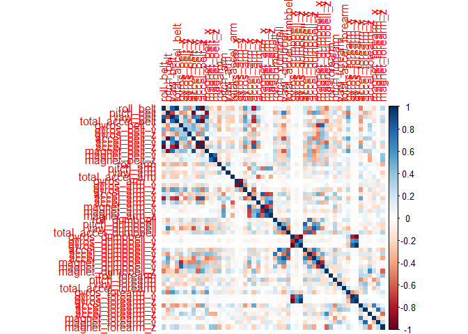
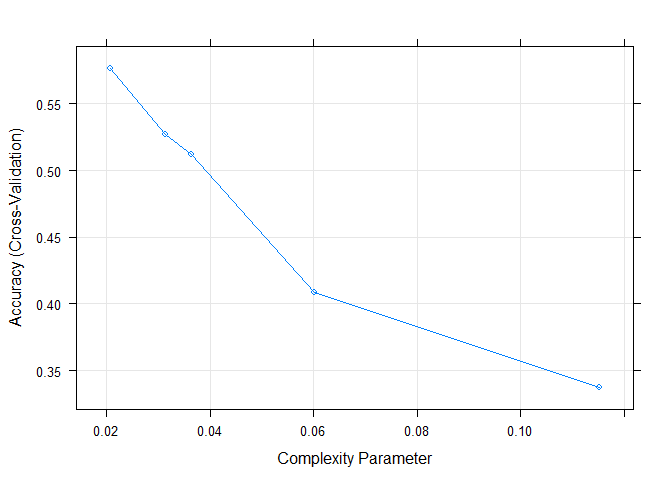
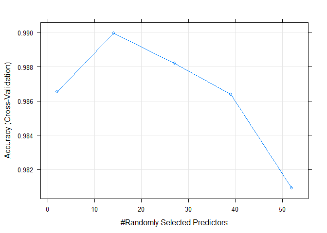
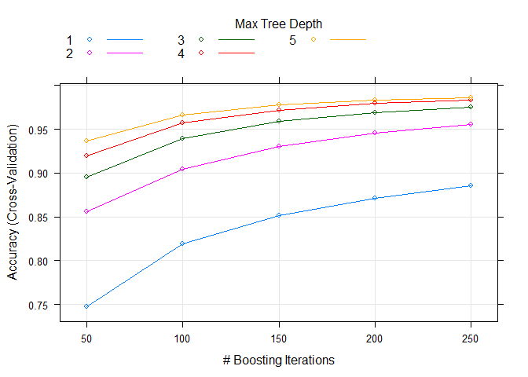

# Overview
This is the final report for Coursera’s Practical Machine Learning course, as part of the Data Science Specialization track offered by John Hopkins. 

In this project, we will use data from accelerometers on the belt, forearm, arm, and dumbell of 6 participants to predict the manner in which they did the exercise. This is the “classe” variable in the training set. We train 4 models: **Decision Tree**, **Random Forest**, **Gradient Boosted Trees**, **Support Vector Machine** using k-folds cross validation on the training set. We then predict using a validation set randomly selected from the training csv data to obtain the **accuracy** and **out of sample error rate**. Based on those numbers, we decide on the best model, and use it to predict 20 cases using the test csv set. (Data Links are Below - Local versions: Downloaded June 16/2020) 


# Background
Using devices such as Jawbone Up, Nike FuelBand, and Fitbit it is now possible to collect a large amount of data about personal activity relatively inexpensively. These type of devices are part of the quantified self movement - a group of enthusiasts who take measurements about themselves regularly to improve their health, to find patterns in their behavior, or because they are tech geeks. One thing that people regularly do is quantify how much of a particular activity they do, but they rarely quantify how well they do it. In this project, your goal will be to use data from accelerometers on the belt, forearm, arm, and dumbell of 6 participants. They were asked to perform barbell lifts correctly and incorrectly in 5 different ways. More information is available from the website here: (http://groupware.les.inf.puc-rio.br/har) (see the section on the Weight Lifting Exercise Dataset).

The training data for this project are available here:

https://d396qusza40orc.cloudfront.net/predmachlearn/pml-training.csv

The test data are available here:

https://d396qusza40orc.cloudfront.net/predmachlearn/pml-testing.csv

The data for this project come from this source: http://web.archive.org/web/20161224072740/http:/groupware.les.inf.puc-rio.br/har. If you use the document you create for this class for any purpose please cite them as they have been very generous in allowing their data to be used for this kind of assignment.


# Loading Data and Libraries
Loading all the libraries and the data

```r
library(lattice)
library(ggplot2)
library(caret)
library(kernlab)
library(rattle)
library(corrplot)
set.seed(1234)
```


```r
traincsv <- read.csv("./data/pml-training.csv")
testcsv <- read.csv("./data/pml-testing.csv")

dim(traincsv)
```

```
## [1] 19622   160
```

```r
dim(testcsv)
```

```
## [1]  20 160
```

We see that there are 160 variables and 19622 observations in the training set, while 20 for the test set.


# Cleaning the Data

Removing unnecessary variables. Starting with N/A variables.

```r
traincsv <- traincsv[,colMeans(is.na(traincsv)) < .9] #removing mostly na columns
traincsv <- traincsv[,-c(1:7)] #removing metadata which is irrelevant to the outcome
```

Removing near zero variance variables.

```r
nvz <- nearZeroVar(traincsv)
traincsv <- traincsv[,-nvz]
dim(traincsv)
```

```
## [1] 19622    53
```

Now that we have finished removing the unnecessary variables, we can now split the training set into a **validation** and sub **training** set. The testing set "testcsv" will be left alone, and used for the final quiz test cases. 

```r
inTrain <- createDataPartition(y=traincsv$classe, p=0.7, list=F)
train <- traincsv[inTrain,]
valid <- traincsv[-inTrain,]
```


# Creating and Testing the Models
Here we will test a few popular models including: **Decision Trees**, **Random Forest**, **Gradient Boosted Trees**, and **SVM**. This is probably more than we will need to test, but just out of curiosity and good practice we will run them for comparison.

Set up control for training to use 3-fold cross validation. 

```r
control <- trainControl(method="cv", number=3, verboseIter=F)
```

## Decision Tree

**Model:** 


```r
mod_trees <- train(classe~., data=train, method="rpart", trControl = control, tuneLength = 5)
fancyRpartPlot(mod_trees$finalModel)
```

<!-- -->

**Prediction:**


```r
pred_trees <- predict(mod_trees, valid)
cmtrees <- confusionMatrix(pred_trees, factor(valid$classe))
cmtrees
```

```
## Confusion Matrix and Statistics
## 
##           Reference
## Prediction    A    B    C    D    E
##          A 1519  473  484  451  156
##          B   28  355   45   10  130
##          C   83  117  423  131  131
##          D   40  194   74  372  176
##          E    4    0    0    0  489
## 
## Overall Statistics
##                                           
##                Accuracy : 0.5366          
##                  95% CI : (0.5238, 0.5494)
##     No Information Rate : 0.2845          
##     P-Value [Acc > NIR] : < 2.2e-16       
##                                           
##                   Kappa : 0.3957          
##                                           
##  Mcnemar's Test P-Value : < 2.2e-16       
## 
## Statistics by Class:
## 
##                      Class: A Class: B Class: C Class: D Class: E
## Sensitivity            0.9074  0.31168  0.41228  0.38589  0.45194
## Specificity            0.6286  0.95512  0.90492  0.90165  0.99917
## Pos Pred Value         0.4927  0.62500  0.47797  0.43458  0.99189
## Neg Pred Value         0.9447  0.85255  0.87940  0.88228  0.89002
## Prevalence             0.2845  0.19354  0.17434  0.16381  0.18386
## Detection Rate         0.2581  0.06032  0.07188  0.06321  0.08309
## Detection Prevalence   0.5239  0.09652  0.15038  0.14545  0.08377
## Balanced Accuracy      0.7680  0.63340  0.65860  0.64377  0.72555
```

## Random Forest


```r
mod_rf <- train(classe~., data=train, method="rf", trControl = control, tuneLength = 5)

pred_rf <- predict(mod_rf, valid)
cmrf <- confusionMatrix(pred_rf, factor(valid$classe))
cmrf
```

```
## Confusion Matrix and Statistics
## 
##           Reference
## Prediction    A    B    C    D    E
##          A 1673    4    0    0    0
##          B    1 1132    8    0    0
##          C    0    3 1016    5    1
##          D    0    0    2  958    0
##          E    0    0    0    1 1081
## 
## Overall Statistics
##                                           
##                Accuracy : 0.9958          
##                  95% CI : (0.9937, 0.9972)
##     No Information Rate : 0.2845          
##     P-Value [Acc > NIR] : < 2.2e-16       
##                                           
##                   Kappa : 0.9946          
##                                           
##  Mcnemar's Test P-Value : NA              
## 
## Statistics by Class:
## 
##                      Class: A Class: B Class: C Class: D Class: E
## Sensitivity            0.9994   0.9939   0.9903   0.9938   0.9991
## Specificity            0.9991   0.9981   0.9981   0.9996   0.9998
## Pos Pred Value         0.9976   0.9921   0.9912   0.9979   0.9991
## Neg Pred Value         0.9998   0.9985   0.9979   0.9988   0.9998
## Prevalence             0.2845   0.1935   0.1743   0.1638   0.1839
## Detection Rate         0.2843   0.1924   0.1726   0.1628   0.1837
## Detection Prevalence   0.2850   0.1939   0.1742   0.1631   0.1839
## Balanced Accuracy      0.9992   0.9960   0.9942   0.9967   0.9994
```

## Gradient Boosted Trees


```r
mod_gbm <- train(classe~., data=train, method="gbm", trControl = control, tuneLength = 5, verbose = F)

pred_gbm <- predict(mod_gbm, valid)
cmgbm <- confusionMatrix(pred_gbm, factor(valid$classe))
cmgbm
```

```
## Confusion Matrix and Statistics
## 
##           Reference
## Prediction    A    B    C    D    E
##          A 1671    5    0    0    0
##          B    1 1128   15    0    0
##          C    2    6 1007    8    4
##          D    0    0    4  953    1
##          E    0    0    0    3 1077
## 
## Overall Statistics
##                                          
##                Accuracy : 0.9917         
##                  95% CI : (0.989, 0.9938)
##     No Information Rate : 0.2845         
##     P-Value [Acc > NIR] : < 2.2e-16      
##                                          
##                   Kappa : 0.9895         
##                                          
##  Mcnemar's Test P-Value : NA             
## 
## Statistics by Class:
## 
##                      Class: A Class: B Class: C Class: D Class: E
## Sensitivity            0.9982   0.9903   0.9815   0.9886   0.9954
## Specificity            0.9988   0.9966   0.9959   0.9990   0.9994
## Pos Pred Value         0.9970   0.9860   0.9805   0.9948   0.9972
## Neg Pred Value         0.9993   0.9977   0.9961   0.9978   0.9990
## Prevalence             0.2845   0.1935   0.1743   0.1638   0.1839
## Detection Rate         0.2839   0.1917   0.1711   0.1619   0.1830
## Detection Prevalence   0.2848   0.1944   0.1745   0.1628   0.1835
## Balanced Accuracy      0.9985   0.9935   0.9887   0.9938   0.9974
```

## Support Vector Machine


```r
mod_svm <- train(classe~., data=train, method="svmLinear", trControl = control, tuneLength = 5, verbose = F)

pred_svm <- predict(mod_svm, valid)
cmsvm <- confusionMatrix(pred_svm, factor(valid$classe))
cmsvm
```

```
## Confusion Matrix and Statistics
## 
##           Reference
## Prediction    A    B    C    D    E
##          A 1537  154   79   69   50
##          B   29  806   90   46  152
##          C   40   81  797  114   69
##          D   61   22   32  697   50
##          E    7   76   28   38  761
## 
## Overall Statistics
##                                           
##                Accuracy : 0.7813          
##                  95% CI : (0.7705, 0.7918)
##     No Information Rate : 0.2845          
##     P-Value [Acc > NIR] : < 2.2e-16       
##                                           
##                   Kappa : 0.722           
##                                           
##  Mcnemar's Test P-Value : < 2.2e-16       
## 
## Statistics by Class:
## 
##                      Class: A Class: B Class: C Class: D Class: E
## Sensitivity            0.9182   0.7076   0.7768   0.7230   0.7033
## Specificity            0.9164   0.9332   0.9374   0.9665   0.9690
## Pos Pred Value         0.8137   0.7177   0.7239   0.8086   0.8363
## Neg Pred Value         0.9657   0.9301   0.9521   0.9468   0.9355
## Prevalence             0.2845   0.1935   0.1743   0.1638   0.1839
## Detection Rate         0.2612   0.1370   0.1354   0.1184   0.1293
## Detection Prevalence   0.3210   0.1908   0.1871   0.1465   0.1546
## Balanced Accuracy      0.9173   0.8204   0.8571   0.8447   0.8362
```

## Results (Accuracy & Out of Sample Error)


```
##      accuracy oos_error
## Tree    0.537     0.463
## RF      0.996     0.004
## GBM     0.992     0.008
## SVM     0.781     0.219
```

**The best model is the Random Forest model, with 0.9957519 accuracy and 0.0042481 out of sample error rate. We find that to be a sufficient enough model to use for our test sets. ** 


# Predictions on Test Set

Running our test set to predict the classe (5 levels) outcome for 20 cases with the **Random Forest** model.

```r
pred <- predict(mod_rf, testcsv)
print(pred)
```

```
##  [1] B A B A A E D B A A B C B A E E A B B B
## Levels: A B C D E
```


# Appendix

Github Repo: [Github](https://github.com/b-zhang93/Practical-Machine-Learning-Project)

correlation matrix of variables in training set

```r
corrPlot <- cor(train[, -length(names(train))])
corrplot(corrPlot, method="color")
```

<!-- -->

Plotting the models

```r
plot(mod_trees)
```

<!-- -->

```r
plot(mod_rf)
```

<!-- -->

```r
plot(mod_gbm)
```

<!-- -->
